# HR Analytics: Salary, Training & Turnover

> **People Analytics Project · Confidential**
> An end-to-end analysis of **2,000 employee records** to evaluate pay equity, training ROI, and employee turnover risk.

---

## 1. Executive Summary

This project analyzes workforce data to answer three leadership questions:

1. **Is employee pay equitable?**
2. **Did the Q3 sales-training program generate a meaningful return?**
3. **When and why are employees leaving?**

### Key Findings

| Area                         | Finding                                         |
| ---------------------------- | ----------------------------------------------- |
| Workforce                    | 2,000 employees across 6 departments            |
| Average salary               | **$88,018**                                     |
| Gender pay test              | **Not statistically significant** (`p = 0.214`) |
| Training revenue lift        | **+$12,027 per trained employee**               |
| Training ROI                 | **~47×**                                        |
| 2-year attrition probability | **41.3%**                                       |
| 5-year attrition probability | **73.6%**                                       |
| Average satisfaction         | **3.0 / 5**                                     |

---

# 2. Project Architecture

The analysis combines five workforce datasets into a single analytical workflow.

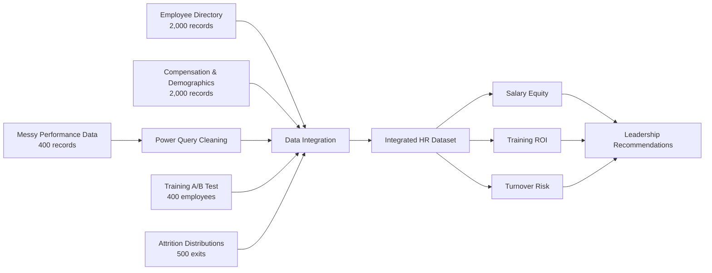

### Data Sources

| Dataset                     |   Records | Purpose                                  |
| --------------------------- | --------: | ---------------------------------------- |
| `Employee_Directory`        |     2,000 | Department, role level, hire date        |
| `Compensation_Demographics` |     2,000 | Salary, bonus, age, gender, satisfaction |
| `Messy_Performance_Data`    | 400 → 352 | Performance data requiring cleaning      |
| `Training_AB_Test`          |       400 | Control vs. training revenue             |
| `Attrition_Distributions`   | 500 exits | Tenure, exit reason, rehire eligibility  |

The source presentation identifies XLOOKUP/INDEX-MATCH, Power Query, pivot tables, descriptive statistics, t-tests, ANOVA, chi-square, and probability models as the main analytical methods.

---

# 3. Data Preparation

## Cleaning Pipeline

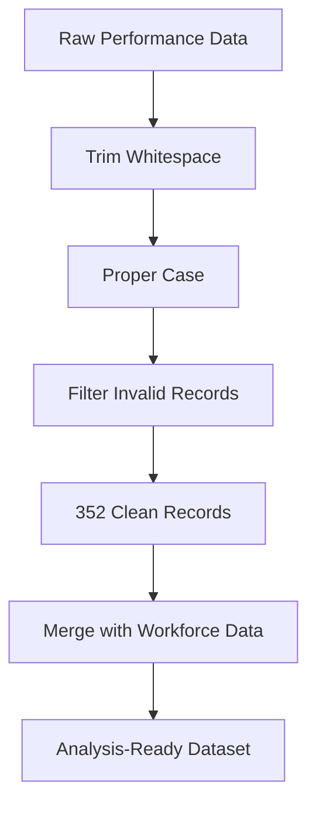

### Integration Strategy

Employee-level information was merged using lookup-based techniques:

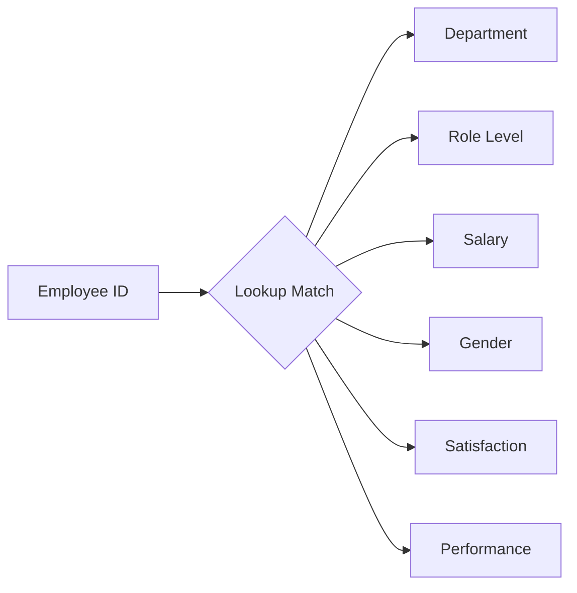

---

# 4. Analytical Framework

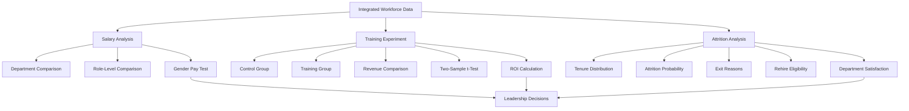

---

# 5. Salary Equity Analysis

## Salary by Role

The strongest salary pattern is associated with **role seniority**.

| Role      | Average Base Salary |
| --------- | ------------------: |
| Junior    |             $49,937 |
| Mid-Level |             $79,736 |
| Senior    |            $109,633 |
| Lead      |            $129,934 |
| Manager   |            $149,997 |
| Director  |            $200,114 |

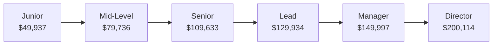

### Interpretation

The presentation identifies an approximately **4× salary spread** between Junior and Director roles, while the department-level spread is considerably smaller. This indicates that **seniority is the stronger salary driver** in the analyzed dataset.

---

# 6. Gender Pay Gap Test

A Welch's two-sample t-test compared male and female base salaries.

| Metric      |    Male |  Female |
| ----------- | ------: | ------: |
| Sample size |     989 |     933 |
| Mean salary | $87,271 | $89,290 |

### Statistical Result

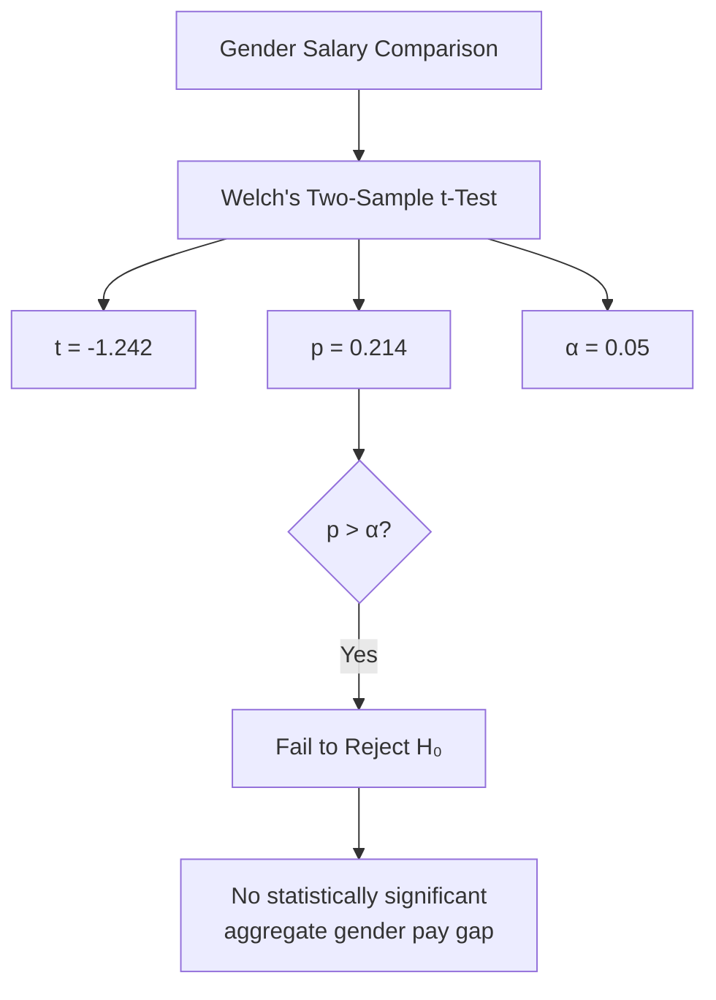

### Conclusion

Because **p = 0.214 > 0.05**, the analysis does not find statistically significant evidence of a gender pay gap at the aggregate level.

However, aggregate parity does **not** eliminate the possibility of differences within individual roles or departments. The recommended next step is therefore to repeat the analysis using role-level and department-level slices.

---

# 7. Training ROI Analysis

## Experimental Design

The Q3 sales-training program was evaluated using two groups:

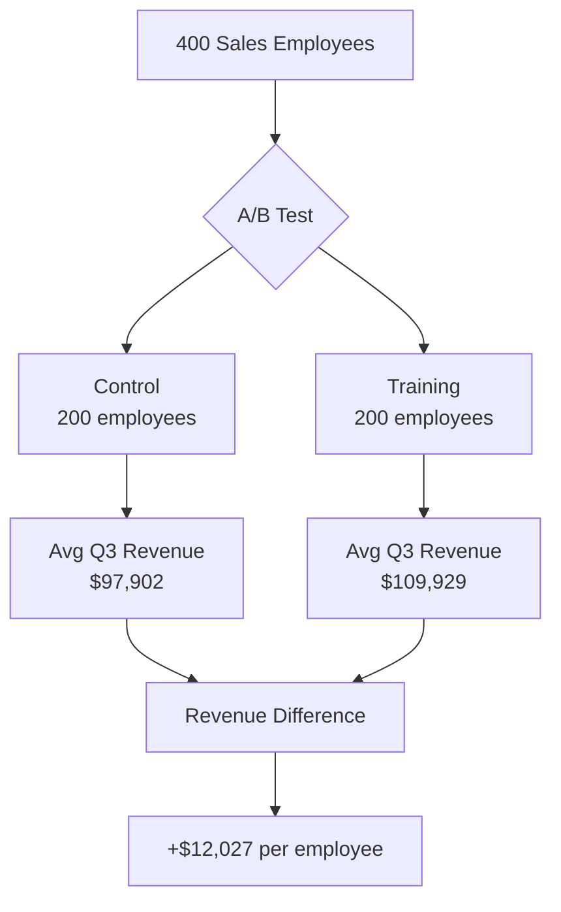

The training group generated an average Q3 revenue of **$109,929**, compared with **$97,902** for the control group.

---

## Statistical Validation

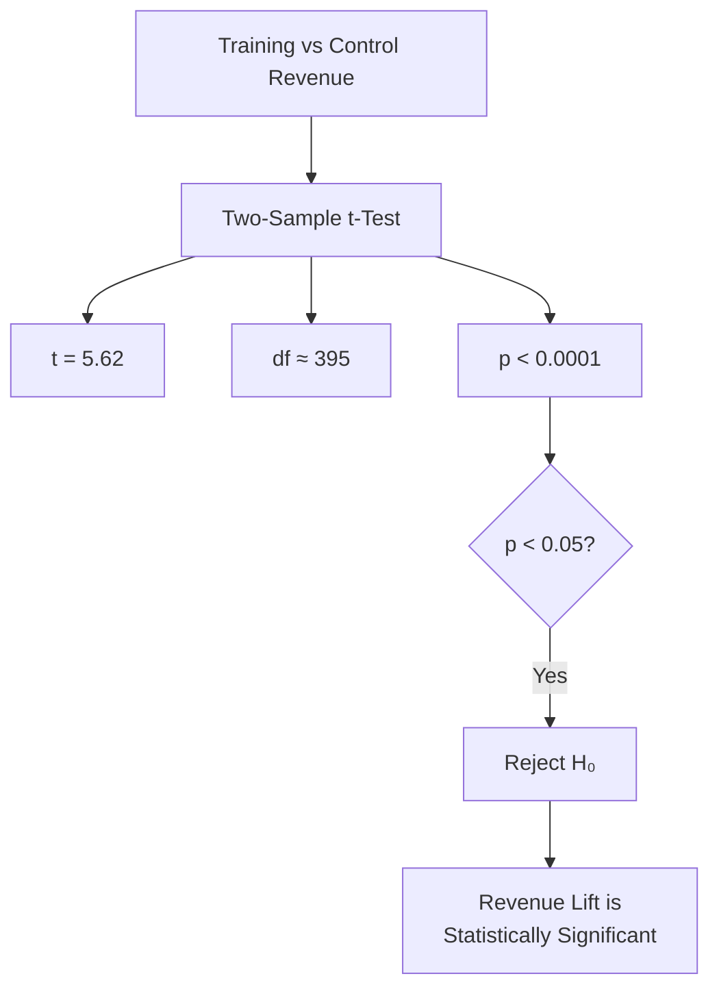

The result is highly statistically significant (`p < 0.0001`), supporting the conclusion that the observed revenue lift is unlikely to be explained by random variation alone.

---

# 8. Training ROI Calculation

### Investment

**Program cost:** $50,000

### Incremental Revenue

```text
$12,027 × 200 employees
≈ $2,405,471 incremental revenue
```

### ROI

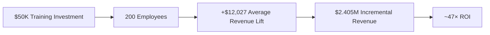

The presentation calculates approximately **47× return on investment** and recommends expanding the training program.

---

# 9. Turnover Risk

## Attrition Model

The turnover analysis models **500 exits** using an exponential distribution.

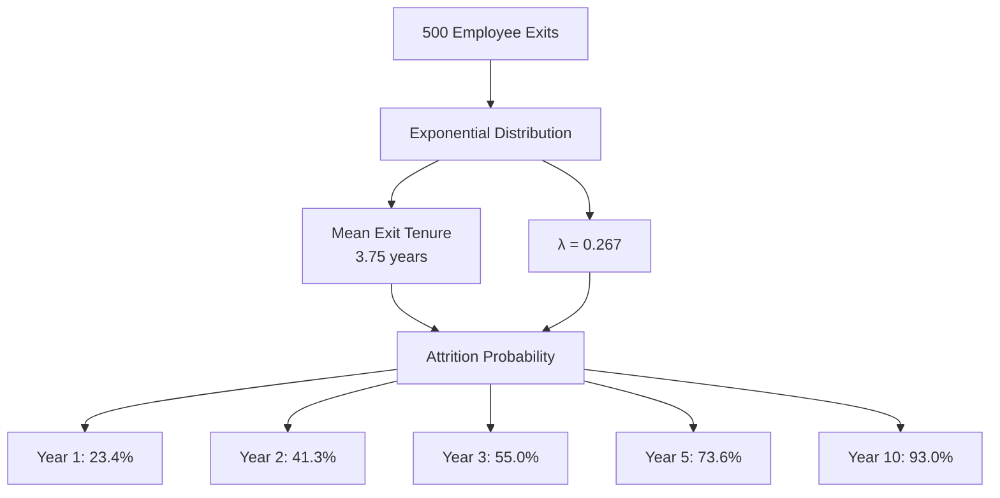

---

## Retention Risk Timeline

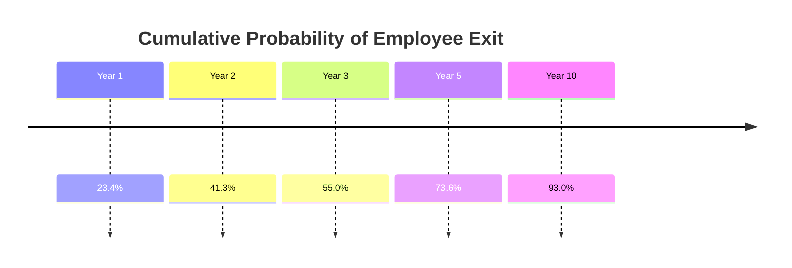

The model estimates a **41.3% probability that a new hire exits within the first two years**. By year five, the modeled cumulative probability reaches **73.6%**.

> **Important modeling note:** The exponential model assumes a constant hazard rate. Therefore, these probabilities describe the fitted model rather than proving that actual employee risk is constant throughout tenure.

---

# 10. Why Employees Leave

The 500 exits were distributed across four recorded reasons:

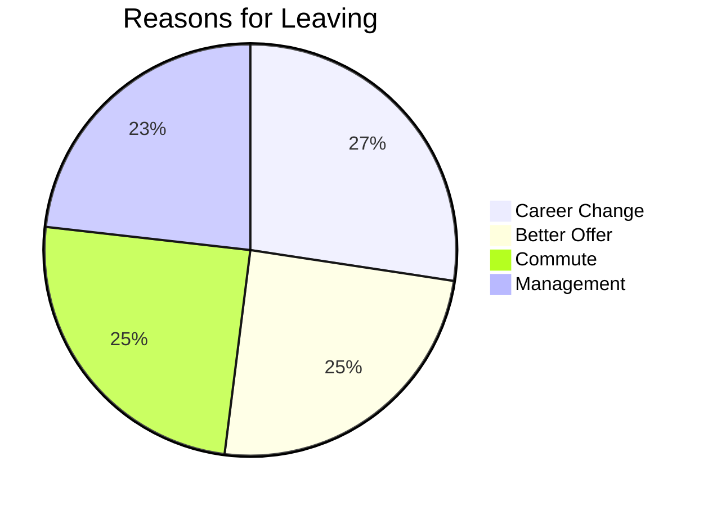

The exit reasons are relatively evenly distributed rather than being dominated by one category.

---

# 11. Additional Statistical Tests

## Exit Reason vs. Rehire Eligibility

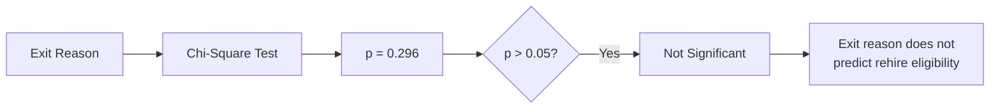

## Satisfaction Across Departments

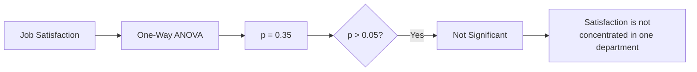

The presentation reports an average satisfaction score of **3.0/5** and finds no statistically significant departmental difference (`p = 0.35`).

---

# 12. Overall Findings

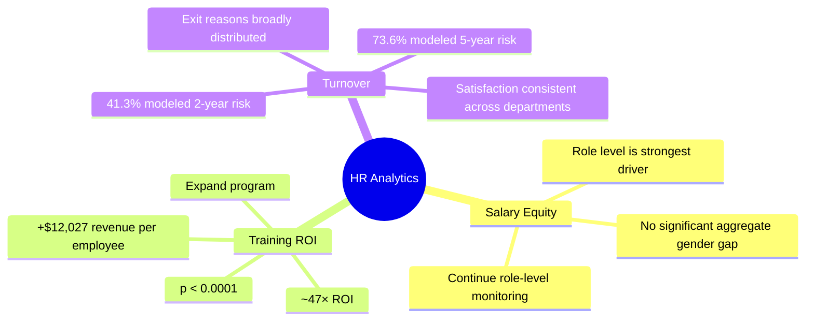

---

# 13. Recommendations

## 1. Scale the Training Program

The Q3 training pilot produced a reported **~47× ROI**.

**Action:**

* Expand the training program.
* Track revenue lift by cohort.
* Continue measuring trained vs. untrained employees.

---

## 2. Front-Load Retention Investment

The modeled probability of leaving reaches **41.3% by year two**.

**Action:**

* Strengthen onboarding.
* Introduce structured mentorship.
* Increase manager check-ins during the first 24 months.
* Monitor early-tenure turnover.

---

## 3. Re-Test Pay Equity Annually

The current aggregate gender comparison is not statistically significant.

**Action:**

* Repeat the test annually.
* Analyze salary by role level.
* Analyze salary by department.
* Monitor changes as workforce composition changes.

---

## 4. Add Qualitative Exit Analysis

Structured exit reasons alone may not capture the full employee experience.

**Action:**

* Improve exit interviews.
* Categorize qualitative responses.
* Compare qualitative themes with compensation, workload, management, and tenure.
* Look for emerging retention drivers.

The presentation recommends qualitative investigation because structured exit data may not capture drivers such as compensation timing or workload.

---

# 14. Decision Framework

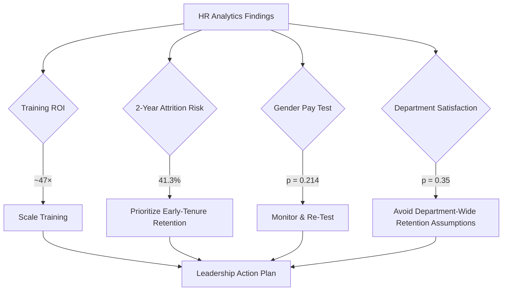

---

# 15. Technology & Methods

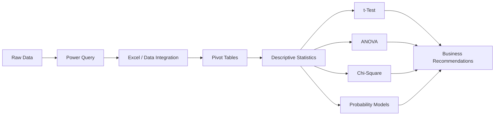

### Methods Used

* XLOOKUP / INDEX-MATCH
* Power Query
* Data cleaning
* Pivot tables
* Descriptive statistics
* Welch's two-sample t-test
* Two-sample t-test
* One-way ANOVA
* Chi-square test
* Exponential probability model
* Binomial probability model

---

# 16. Final Takeaway

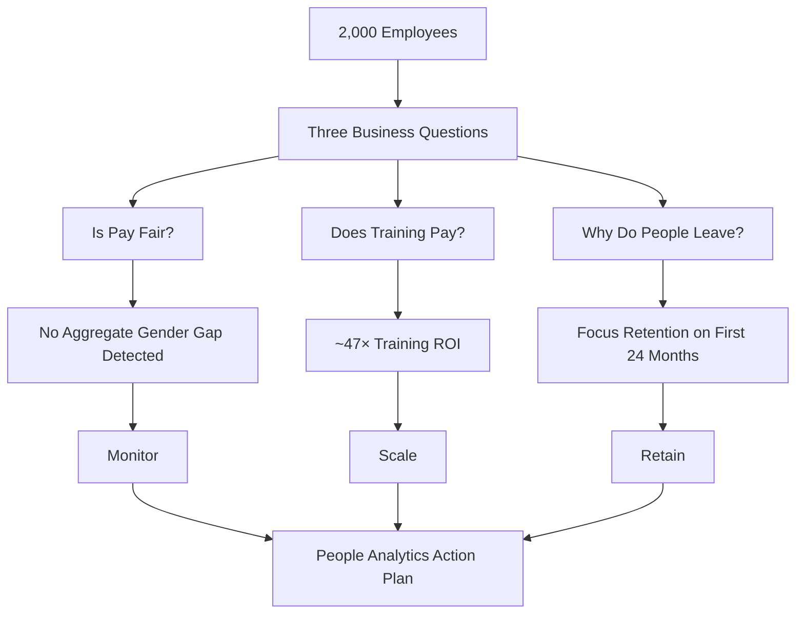

> **Bottom line:** The analysis points to three immediate priorities: **scale what works, invest earlier in retention, and continue monitoring equity at a more granular level.**

---

## Source

**HR Analytics Presentation — Salary, Training & Turnover**

The presentation states that full detail, including live formulas, pivot tables, and statistical tests, is available in the companion workbook `HR_Analytics_Solved.xlsx`.

